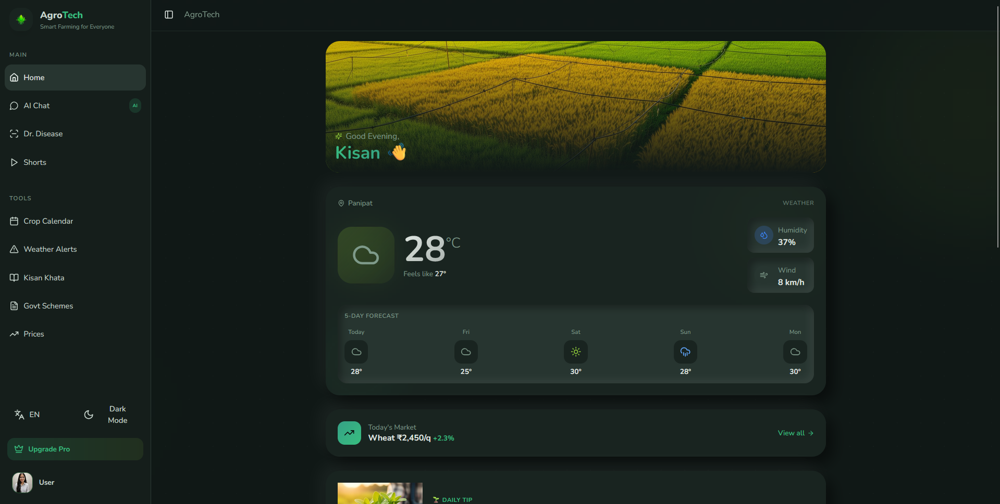
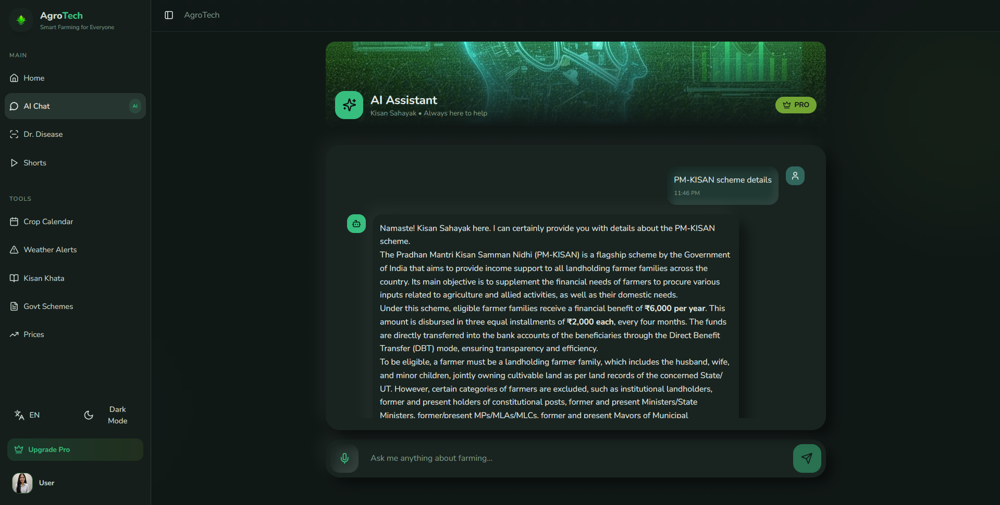
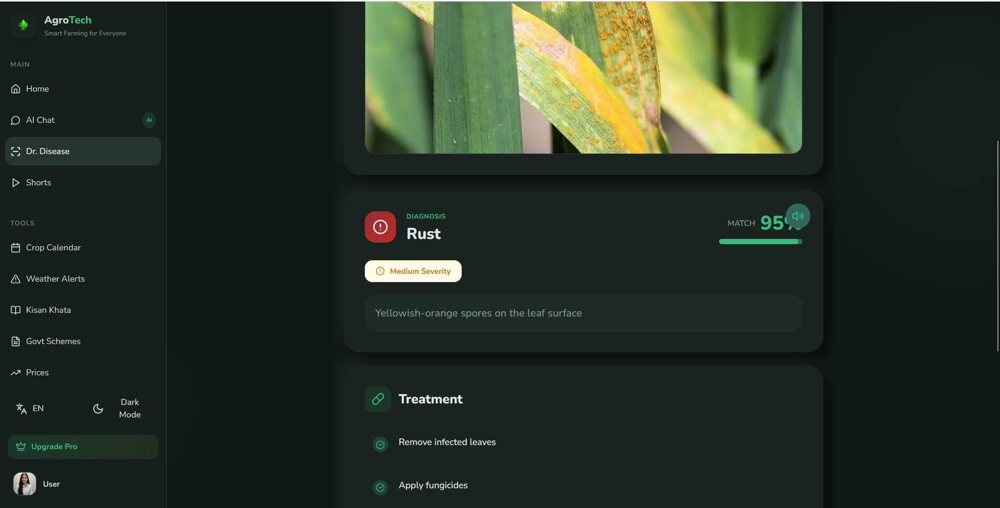
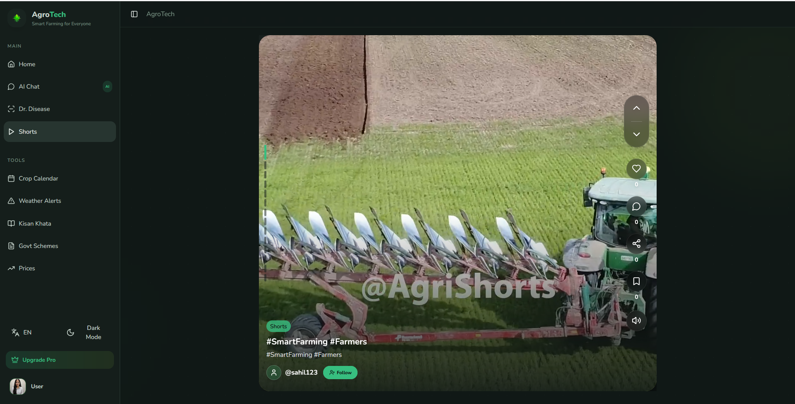
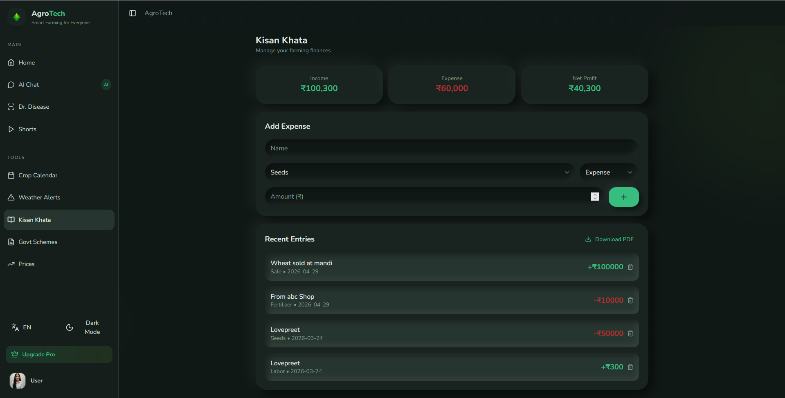
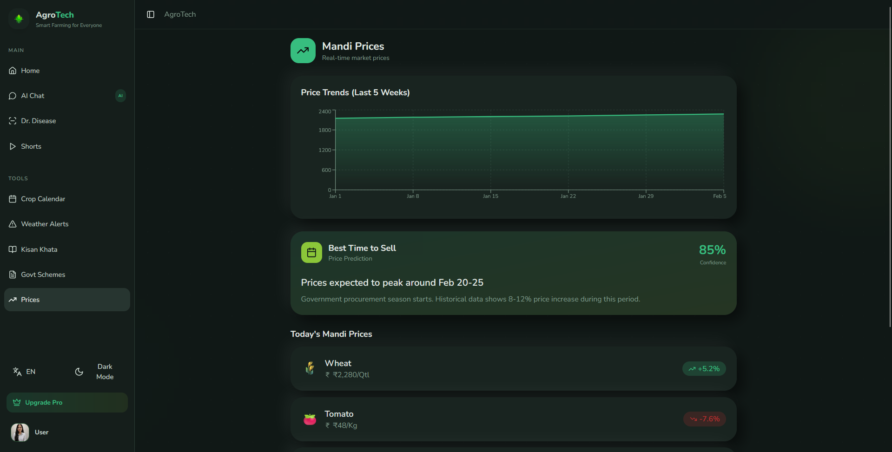

<div align="center">

<!--  -->

# 🌾 AGROTECH — SMART FARMING

### *Empowering Every Farmer with the Power of Technology*

[](https://react.dev)
[](https://aistudio.google.com/)
[](LICENSE)
[](CONTRIBUTING.md)
[](https://agrotech-smart-farming.vercel.app/)

---

> **AgroTech** is a comprehensive, AI-driven smart farming application designed to bridge the gap between modern technology and traditional agriculture — helping farmers make smarter decisions, track finances, stay informed, and grow better crops.

### 🚀 [Click here to view the Live Demo on Vercel](https://agro-tech-virid.vercel.app/)

</div>

---

## 📸 Screenshots

<div align="center">

| Dashboard | AI Assistant | Dr. Diseases |
|:---------:|:------------:|:------------:|
|  |  |  |

| Shorts | Kisan Khata | Mandi Prices |
|:------:|:-----------:|:------------:|
|  |  |  |

</div>

---

## ✨ Features Overview

### 🏠 Main Features

#### 📊 Smart Dashboard
- Unified home screen with quick access to all modules
- Personalized greetings and daily farming summaries
- Real-time weather snapshot and upcoming crop calendar events
- Latest mandi prices and government scheme highlights at a glance

---

#### 🤖 AI Chat Assistant
- Powered by advanced AI to answer all farming-related queries
- **Multi-language support** — farmers can select their preferred language (Hindi, Punjabi, Marathi, Telugu, and more)
- **Voice input (Mic)** — speak naturally and get instant AI-powered answers
- Context-aware conversations for crop care, soil management, pest control, and more
- **Pro users** get unlimited AI chats; free users have a daily limit

```
🌐 Supports: Hindi, Punjabi, Marathi, Gujarati, Tamil, Telugu, Bengali, English & more
🎙️ Voice Input: Tap the mic, ask your question, get your answer
```

---

#### 🔬 Dr. Diseases — Crop Disease Detection
- **AI-powered crop disease scanner** using image recognition
- Scan infected crop leaves using the camera or upload from gallery
- Instantly detects whether the crop is infected or healthy
- Provides detailed diagnosis with **recommended fertilizers and treatments**
- Works on a wide variety of crops (wheat, rice, tomato, cotton, sugarcane, etc.)
- **Pro users** get unlimited scans; free tier includes limited monthly scans.

```
📷 Scan → 🧠 AI Analyzes → 💊 Get Treatment Plan
```

---

#### 🎬 Shorts — Farming Reels
- Discover **short farming-related video reels** curated for Indian farmers
- **Like, Save, and Share** reels with your farming community
- **Upload your own reels/posts** directly from your farmer profile
- Follow other farmers and creators for daily tips and inspiration
- Community-driven content in regional languages

---

### 🛠️ Tools

#### 📅 Crop Calendar
- **Precision sowing-to-harvesting calendar** for every crop
- Based on region, soil type, and season
- Get exact dates for: sowing → irrigation → fertilization → harvesting
- Notifications and reminders for each crop stage
- Supports Kharif, Rabi, and Zaid crop cycles

---

#### ⛅ Weather Alerts
- Real-time, location-based **weather forecasting**
- Rain, heatwave, frost, and storm alerts tailored for farmers
- 7-day extended forecast for better pre-planning
- Smart alerts: "Rain expected in 2 days — delay fertilizer application"

---

#### 💰 Kisan Khata — Farm Ledger
- A **complete financial management system** for farmers
- Track all **income and expenses** (seeds, fertilizers, labour, irrigation, yield sold)
- Savings tracking and surplus/deficit visualization
- **Download PDF reports** for monthly or seasonal accounts
- Simple, easy-to-use interface built for low-literacy users

```
📥 Expenses  |  📤 Savings  |  📄 PDF Export
```

---

#### 🏛️ Government Schemes
- Stay updated with **all active government schemes** for farmers
- PM-KISAN, Fasal Bima Yojana, Soil Health Card, KCC and more
- Filter by state, crop type, or scheme category
- Direct application links and eligibility checklist
- Push notifications for new scheme launches and deadlines

---

#### 📈 Mandi Prices
- Live **market price tracking** for all major crops
- Browse prices from APMCs/mandis across different states
- Historical price trends to plan the best time to sell
- Price comparison between local and nearby mandis
- Supports 100+ crops including grains, vegetables, and oilseeds

---

### 🎨 UI / UX

| Feature | Details |
|---------|---------|
| 🌙 Dark / Light Mode | Full app-wide dark and light theme support |
| 🌐 Language Selection | Multi-language UI across the entire app |
| 👤 User Profile | Upload posts, view followers/following, update profile picture |
| ⭐ Pro Subscription | Upgrade to unlock unlimited AI chats & disease scans |
| 📱 Responsive Design | Optimized for all screen sizes |

---

## 💎 Pro Subscription

| Feature | Free | Pro |
|---------|:----:|:---:|
| AI Chat | Limited (Daily Credits) | ✅ Unlimited |
| Disease Scans | Limited (Daily Credits) | ✅ Unlimited |
| Mandi Prices | ✅ | ✅ |
| Crop Calendar | ✅ | ✅ |
| Kisan Khata | ✅ | ✅ |
| Gov. Schemes | ✅ | ✅ |
| Shorts & Profile | ✅ | ✅ |

---

## 👤 User Profile

- Upload and manage a **personal farming profile**
- Post your own content (reels, images, tips)
- View **followers and following** count
- Update profile picture and bio
- See your uploaded shorts and saved content

---

## 🚀 Getting Started

### Prerequisites

```bash
Node.js >= 18.0.0
npm or yarn
Supabase CLI (for local backend deployment)
```

### Installation

```bash
# Clone the repository
git clone https://github.com/Lovepreet-Kaur-Gill/AGROTECH-SMART-FARMING.git

# Navigate to project directory
cd AGROTECH-SMART-FARMING

# Install dependencies
npm install

# Run the app
npm run dev
```

### Environment Setup

Create a `.env` file in the root directory:

```env
VITE_SUPABASE_URL="your_supabase_project_url"
VITE_SUPABASE_ANON_KEY="your_supabase_anon_key"
```

---

## 🏗️ Tech Stack

| Layer | Technology |
|-------|------------|
| Frontend | React.js (Vite) / Tailwind CSS |
| AI / ML | Google Gemini AI (Flash & Vision) |
| Backend & Serverless | Supabase Edge Functions (TypeScript/Deno) |
| Database | Supabase PostgreSQL |
| Auth | Supabase Auth |
| Storage | Supabase Storage |
| Weather | Open-Meteo API |
| State Management | React Context API / Custom Hooks |

---

## 🌍 Supported Languages

🇮🇳 Hindi  |  Punjabi  |  Marathi  |  Gujarati  |  Tamil  |  Telugu  |  Bengali  |  Kannada  |  🇬🇧 English

---

## 🤝 Contributing

Contributions are welcome! Please follow these steps:

1. Fork the repository
2. Create your feature branch: `git checkout -b feature/AmazingFeature`
3. Commit your changes: `git commit -m 'Add some AmazingFeature'`
4. Push to the branch: `git push origin feature/AmazingFeature`
5. Open a Pull Request

---

## 📄 License

This project is licensed under the MIT License — see the [LICENSE](LICENSE) file for details.

---

## 🤝 Meet Our Team

This project is proudly built and maintained by our dedicated team. We believe in building technology that creates a real impact.

<div align="center">

| <a href="https://github.com/sahilsingh682"></a> | <a href="https://github.com/pushpender1043"></a> | <a href="https://github.com/Lovepreet-Kaur-Gill"></a> |
| :---: | :---: | :---: |
| **Sahil Singh** | **Pushpender Mishra** | **Lovepreet Kaur** |
| AI & Full Stack Developer | Full Stack Developer | AI & Full Stack Developer |
| [GitHub](https://github.com/sahilsingh682) <br> [LinkedIn](https://www.linkedin.com/in/sahilsingh0521) | [GitHub](https://github.com/pushpender1043) <br> [LinkedIn](https://www.linkedin.com/in/pushpender-mishra) | [GitHub](https://github.com/Lovepreet-Kaur-Gill) <br> [LinkedIn](https://www.linkedin.com/in/lovepreet05) |

</div>

---

## 📬 Contact

**Project:** AgroTech Smart Farming  
**Developer:** Lovepreet Kaur  
**Email:** preetkaurgill437@gmail.com  
**GitHub:** [@Lovepreet-Kaur-Gill](https://github.com/Lovepreet-Kaur-Gill)

---

<div align="center">

### ⭐ If this project helped you, please give it a star!

*Made with ❤️ for the Farmers of India*


</div>
